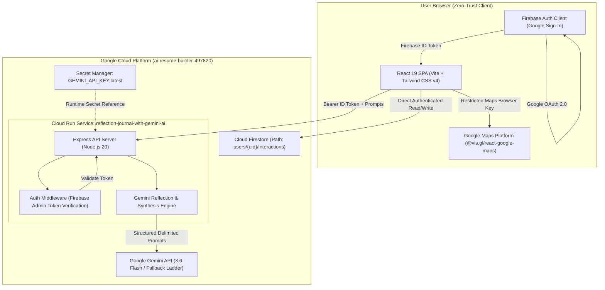

# Gemini LifeLog — Private AI Memory & Reflection Assistant

[](https://cloud.google.com/run)
[](https://ai.google.dev/)
[](https://firebase.google.com/)
[](https://developers.google.com/maps)
[](LICENSE)

> **Google Cloud Run AI Challenge Submission**  
> *Private, user-isolated journaling, multi-turn AI reflections, structured insight extraction, chronological timeline search, and interactive memory mapping powered by Google Gemini, Google Cloud Run, and Cloud Firestore.*

---

## 1. Project Overview & Live Demo

**Gemini LifeLog** transforms personal journaling from an ephemeral scratchpad into an intelligent, private self-growth companion. Built from the ground up with a **zero-trust privacy-first architecture**, it ensures that personal entries, emotional reflections, and geographical memory locations are mathematically isolated to the authenticated user's private vault in Cloud Firestore.

- **Live Production URL**: [https://reflection-journal-with-gemini-ai-bgnfyu4eqa-as.a.run.app](https://reflection-journal-with-gemini-ai-bgnfyu4eqa-as.a.run.app)
- **Deployment Platform**: Google Cloud Run (Region: `asia-southeast1`)
- **Challenge Verification Label**: `dev-tutorial=cloud-run-ai-challenge`

### Key Innovations:
1. **Save-Before-Analysis Guarantee**: User entries are committed to Cloud Firestore *before* calling AI models. Network failures, rate limits, or Gemini timeouts never cause data loss.
2. **Server-Side Token Authentication**: All backend AI routes strictly verify Firebase ID tokens via the Firebase Admin SDK (`requireAuth`).
3. **Structured AI Insight Extraction**: Real-time extraction of schema-constrained metadata (titles, summaries, topic tags, key ideas, action items, mood).
4. **Chronological Timeline Search**: Multi-field client-side search across title, prompt, response, topic tags, and mood categories.
5. **Interactive Memory Map Canvas**: Private spatial visualization plotting 100% opt-in geotagged memories via Google Maps Platform.
6. **Privacy & Security Center**: Complete client-side JSON and Markdown export alongside irreversible typed-confirmation (`DELETE`) data purges.

---

## 2. Beyond the Starter Codelab

| Feature Area | Starter Codelab | Gemini LifeLog (Challenge Submission) |
| :--- | :--- | :--- |
| **Backend Security** | Unauthenticated `/api/*` endpoints vulnerable to quota draining | **Strict Firebase ID Token Verification** via Firebase Admin SDK (`requireAuth`) |
| **Data Persistence** | User text only saved *after* Gemini responds | **Resilient Save-Before-Analysis**: User text saved first; AI analysis is separately retryable |
| **AI Output Structure** | Free-form markdown chat response only | **Structured Metadata Engine**: Schema-constrained titles, summaries, tags, key ideas, action items, and mood |
| **Journal Organization** | Simple sidebar list without filtering | **Dedicated Chronological Timeline** with multi-field search, topic filters, mode selectors, and sort order |
| **Personal Analytics** | None | **Personal Insights Dashboard**: Entry cadence, topic frequency distribution, mood metrics, and weekly AI synthesis |
| **Location & Memories** | None | **Privacy-First Memory Map**: Opt-in location-aware journal memories rendered on an interactive Google Maps Platform map with per-user data isolation, marker popups, accessible list fallback, and defensive coordinate validation |
| **Data Governance** | No export or deletion tools | **Privacy & Security Center**: Client-side JSON / Markdown data export and typed `DELETE` confirmation purge |
| **Prompt Safety** | User prompt injected directly into context | **Prompt Injection Hardened**: Explicit untrusted XML delimiters and strict non-override system instructions |
| **Test Coverage** | 0 tests | **33 Automated Tests**: 30 Vitest unit/API/Maps tests + 3 Firebase Security Rules emulator tests |

---

## 3. Technology Stack

- **Frontend**: React 19, TypeScript, Vite 6, Tailwind CSS v4, Lucide Icons, Motion.
- **Maps Integration**: `@vis.gl/react-google-maps` (Google Maps Platform Maps JavaScript API).
- **Backend**: Node.js 20, Express 4, TypeScript, `tsx`, `esbuild`.
- **AI Engine**: Google Gen AI SDK (`@google/genai`), primary model `gemini-3.6-flash`.
- **Identity & Auth**: Firebase Authentication (Google Identity Provider).
- **Database**: Google Cloud Firestore (path-based per-user document isolation).
- **Secrets Management**: Google Cloud Secret Manager (`GEMINI_API_KEY`).
- **Hosting & Runtime**: Google Cloud Run (Containerized SPA + Express proxy).
- **Testing**: Vitest, Supertest, `@firebase/rules-unit-testing`, Firebase Local Emulator Suite.

---

## 4. Architecture Overview



### Security Boundary Clarification:
- **AI Reflection Endpoints (`/api/gemini/*`)**: Server-side proxy running on Cloud Run, verified via Firebase Admin SDK using short-lived Firebase ID tokens.
- **Data Export & Deletion**: Executed client-side via Firebase Client SDK directly against Cloud Firestore under authenticated user credentials. Cloud Firestore security rules strictly enforce per-user data isolation (`request.auth.uid == userId`), making cross-user export or deletion impossible.
- **Cloud Run Access Model**: Cloud Run service is intentionally deployed with `--allow-unauthenticated` to serve public web frontend assets without Google Cloud IAM requirements. Application-level authorization is enforced by Firebase Authentication and server-side token checks on sensitive API routes.

---

## 5. Resilient Gemini Fallback Ladder

To guarantee high availability under real-world quota or transient outages, the backend implements an automatic 4-tier model fallback ladder:

1. **`gemini-3.6-flash`** — Primary high-performance reflection engine.
2. **`gemini-3.1-flash-lite`** — High-availability low-latency fallback.
3. **`gemini-flash-latest`** — Dynamic floating production alias.
4. **`gemini-3.7-flash`** — Deep reasoning fallback for complex multi-turn sessions.

Recoverable HTTP status codes (`503`, `429`, `500`, `404`) trigger transparent failover before returning an error to the user.

---

## 6. Cloud Firestore Security Rules

Deploy the included hardened rules to enforce path-based per-user data isolation:

```javascript
rules_version = '2';
service cloud.firestore {
  match /databases/{database}/documents {
    // Zero Insecure Defaults: deny all unspecified collections
    match /{document=**} {
      allow read, write: if false;
    }

    // Per-user data isolation: strictly owner-bound read and write
    match /users/{userId} {
      allow read, write: if request.auth != null && request.auth.uid == userId;

      match /interactions/{interactionId} {
        allow read, delete: if request.auth != null && request.auth.uid == userId;
        allow create, update: if request.auth != null && request.auth.uid == userId
          && request.resource.data.userId == userId;
      }
    }
  }
}
```

### How the Rules Protect User Privacy:
- **Path-Based Confinement**: All journal interactions reside under `/users/{userId}/interactions/{interactionId}`.
- **Strict UID Matching**: Read, create, update, and delete actions are blocked unless `request.auth.uid == userId`.
- **Payload Integrity**: Document creation requires `request.resource.data.userId == userId`, preventing identity spoofing.
- **Zero Default Access**: All unspecified root collections are explicitly rejected with `allow read, write: if false;`.

### Deploying Firestore Rules:
```bash
firebase deploy --only firestore:rules
```

---

## 7. Google Maps Platform Integration (Memory Map)

Gemini LifeLog integrates **Google Maps Platform** via `@vis.gl/react-google-maps` to render private, opt-in geotagged memories on an interactive map.

### Architecture & Privacy Model:
- **Private Per-User Visualization**: The map exclusively displays markers originating from the authenticated user's isolated Firestore collection (`/users/{userId}/interactions`).
- **Defensive Coordinate Sanitization**: Coordinates are validated before passing to map components (finite numbers within `[-90, 90]` latitude and `[-180, 180]` longitude). Entries missing location or with invalid coordinates are safely omitted without crashing the viewport.
- **Graceful Degradation**: If `VITE_GOOGLE_MAPS_API_KEY` is not provided or fails to initialize, the application renders a clean developer-safe notice (`"Google Maps is not configured for this deployment"`), while the complete keyboard-accessible list of memories and the rest of the application remain 100% operational.
- **Zero Geolocation Infiltration**: Visiting the Memory Map never triggers automated browser geolocation prompts, and coordinates are never forwarded to Gemini LLM reflection prompts.
- **Accessible Design**: An interactive sidebar list accompanies the map, enabling keyboard and screen-reader users to select and inspect geotagged memories without interacting with the graphical canvas.

### Browser API Key Security:
Browser-side Maps JavaScript API keys are delivered to client browsers by design. Therefore, security is enforced through **Google Maps Platform Key Restrictions** rather than secrecy:

1. **Enable Maps JavaScript API**: In Google Cloud Console, enable the **Maps JavaScript API** (`maps-backend.googleapis.com`).
2. **Create Browser API Key**: Go to **Google Cloud Console -> APIs & Services -> Credentials -> Create Credentials -> API Key**.
3. **Application Restrictions**: Under *Set application restrictions*, choose **Websites (HTTP referrers)** and specify:
   - Production: `https://<YOUR_CLOUD_RUN_SERVICE_URL>/*`
   - Development: `http://localhost:5173/*` and `http://localhost:3000/*`
4. **API Restrictions**: Under *API restrictions*, select **Restrict key** and choose strictly **Maps JavaScript API**.
5. **Supply at Build Time**: Set `VITE_GOOGLE_MAPS_API_KEY` during Vite build. Never deploy an unrestricted production key.

---

## 8. Credentials & Configuration Architecture

The application cleanly separates server-side secrets from browser build-time configurations:

| Credential | Scope | Transport / Storage | Protection Mechanism |
| :--- | :--- | :--- | :--- |
| **`GEMINI_API_KEY`** | Backend Runtime | Google Cloud Secret Manager (`valueFrom.secretKeyRef`) | Never sent to browser; never logged; mounted via Cloud Run Secret Manager reference |
| **`VITE_GOOGLE_MAPS_API_KEY`** | Frontend Bundle | Vite build-time environment variable (`ARG` in Docker) | Restricted by Google Cloud Console: HTTP referrers + Maps JavaScript API only |
| **Firebase Web Config** | Frontend Client | `firebase-applet-config.json` | Public client identifiers protected by Firebase Authentication and Firestore Security Rules |

---

## 9. End-to-End Deployment Guide

### Prerequisites
- [Google Cloud SDK (`gcloud`)](https://cloud.google.com/sdk/docs/install) authenticated.
- [Firebase CLI (`firebase`)](https://firebase.google.com/docs/cli) installed.
- Docker or Google Cloud Build.

### Step 1: Enable Required Google Cloud APIs
```bash
gcloud services enable \
  run.googleapis.com \
  secretmanager.googleapis.com \
  firestore.googleapis.com \
  cloudbuild.googleapis.com \
  maps-backend.googleapis.com \
  --project="YOUR_PROJECT_ID"
```

### Step 2: Configure Runtime Service Account & Secret Manager
```bash
# 1. Create dedicated runtime service account
gcloud iam service-accounts create lifelog-runner \
  --description="Runtime identity for Gemini LifeLog Cloud Run service" \
  --display-name="lifelog-runner" \
  --project="YOUR_PROJECT_ID"

# 2. Grant logging role
gcloud projects add-iam-policy-binding YOUR_PROJECT_ID \
  --member="serviceAccount:lifelog-runner@YOUR_PROJECT_ID.iam.gserviceaccount.com" \
  --role="roles/logging.logWriter"

# 3. Create Gemini Secret in Secret Manager
gcloud secrets create GEMINI_API_KEY \
  --replication-policy="automatic" \
  --project="YOUR_PROJECT_ID"

# 4. Add secret version (replace with your actual Gemini API key)
echo -n "YOUR_ACTUAL_GEMINI_KEY" | gcloud secrets versions add GEMINI_API_KEY \
  --data-file=- \
  --project="YOUR_PROJECT_ID"

# 5. Grant Secret Accessor specifically to the runtime service account
gcloud secrets add-iam-policy-binding GEMINI_API_KEY \
  --member="serviceAccount:lifelog-runner@YOUR_PROJECT_ID.iam.gserviceaccount.com" \
  --role="roles/secretmanager.secretAccessor" \
  --project="YOUR_PROJECT_ID"
```

### Step 3: Deploy Firestore Security Rules
```bash
firebase use YOUR_PROJECT_ID
firebase deploy --only firestore:rules
```

### Step 4: Build Container with Maps Configuration
Use Google Cloud Build to compile the frontend with your restricted Google Maps Platform key:

```bash
gcloud builds submit \
  --config cloudbuild.yaml \
  --substitutions _VITE_GOOGLE_MAPS_API_KEY="YOUR_RESTRICTED_MAPS_KEY" \
  --project="YOUR_PROJECT_ID"
```

### Step 5: Deploy to Google Cloud Run
Deploy the container with the mandatory Secret Manager reference and AI Challenge label:

```bash
gcloud run deploy reflection-journal-with-gemini-ai \
  --image="gcr.io/YOUR_PROJECT_ID/reflection-journal-with-gemini-ai:latest" \
  --region="asia-southeast1" \
  --project="YOUR_PROJECT_ID" \
  --platform="managed" \
  --allow-unauthenticated \
  --service-account="lifelog-runner@YOUR_PROJECT_ID.iam.gserviceaccount.com" \
  --set-secrets="GEMINI_API_KEY=GEMINI_API_KEY:latest" \
  --update-labels="dev-tutorial=cloud-run-ai-challenge"
```

### Step 6: Add Authorized Domain to Firebase Authentication
In the [Firebase Console](https://console.firebase.google.com/):
1. Navigate to **Authentication -> Settings -> Authorized Domains**.
2. Click **Add Domain** and enter your Cloud Run service hostname:
   `reflection-journal-with-gemini-ai-bgnfyu4eqa-as.a.run.app`

---

## 10. Local Development Setup

```bash
# 1. Clone repository
git clone https://github.com/vishalvermauts/Personal-Gemini-Journal.git
cd Personal-Gemini-Journal

# 2. Install dependencies
npm install

# 3. Configure local environment
cp .env.example .env
# Edit .env and supply GEMINI_API_KEY and VITE_GOOGLE_MAPS_API_KEY

# 4. Start local development server (port 3000)
npm run dev

# 5. Run static analysis & type checks
npm run lint

# 6. Run automated test suites
npm test

# 7. Run Firestore rules tests with local emulator
npm run test:rules

# 8. Build production bundle
npm run build
```

---

## 11. Automated Testing Suite

The repository features comprehensive automated test coverage (33 passing tests):

```bash
# Run unit, route authorization, and Maps resilience test suites (30 tests)
npm test

# Run Firestore Security Rules authorization matrix against Firebase Emulator (3 tests)
npm run test:rules
```

### Test Coverage Highlights:
- **Backend Route Protection**: Verifies `/api/gemini/reflect`, `/api/gemini/analyze`, and `/api/gemini/synthesis` return `401 Unauthorized` on missing, malformed, or expired tokens.
- **Identity Spoofing Resistance**: Verifies client-supplied `userId` cannot hijack the authenticated UID.
- **Prompt Validation**: Enforces maximum bounds (12,000 characters) and turn array schemas (`400 Bad Request`).
- **Privacy Verification**: Confirms `/api/health` exposes zero secrets, keys, or timestamps.
- **Zero-Crash Undefined Stripping**: Confirms undefined values are safely scrubbed before database commits.
- **Export Sanitization**: Confirms exported JSON and Markdown exclude all tokens and credentials.
- **Google Maps Coordinate Validation**: Rejects `NaN`, `null`, `undefined`, and out-of-bounds latitude/longitude points; safely handles entries without location; validates formatting.
- **Firestore Authorization Matrix**: Validates User A can read/write own documents, User B is denied read/write/delete access to User A's data, and unauthenticated requests are denied.

---

## 12. Security Notes

- **Credentials & API Keys**: No server-side secrets, service-account private keys, or Gemini credentials are stored in the repository. Firebase Web configuration represents public client identifiers secured by Firebase Authentication and Firestore Security Rules. Google Maps uses a browser-restricted API key supplied strictly at build time.
- **Runtime Least Privilege**: Cloud Run runs under a dedicated service account (`lifelog-runner`) granted only secret access to `GEMINI_API_KEY` and write access to Cloud Logging.
- **No Service Account Keys**: Authenticates with Firebase Admin and Google Cloud APIs via Application Default Credentials (ADC).
- **Prompt Injection Defense**: Untrusted user inputs are isolated within XML-like boundaries.

---

## 13. License

This project is licensed under the Apache 2.0 / MIT License.
