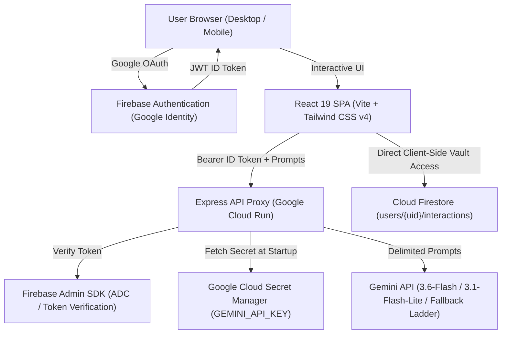

# Gemini LifeLog — Private AI Memory & Reflection Assistant

> **Google Cloud Run AI Challenge Submission**
> *Private, user-isolated journaling, multi-turn AI reflections, structured insight extraction, chronological timeline search, and memory mapping powered by Google Gemini and Cloud Firestore.*

---

## 1. Project Overview & Pitch

**Gemini LifeLog** transforms daily journaling from a passive text document into an active, private self-growth companion. Built with a **zero-trust privacy-first architecture**, it ensures that personal reflections are mathematically isolated to the authenticated user's private vault in Cloud Firestore, while leveraging **Gemini 3.6 Flash** (with a 4-tier resilient fallback ladder) to synthesize structured insights, topic trends, action items, and geographical memory maps.

### Key Innovations:
- **Save-Before-Analysis Resilience**: User words are written to Firestore *before* calling AI models. Network hiccups or Gemini timeouts never cause data loss.
- **Server-Side Token Verification**: All backend AI routes authenticate Firebase ID tokens via the Firebase Admin SDK.
- **Structured AI Insights**: Schema-constrained extraction of concise titles, summaries, topic tags, key ideas, and action items.
- **Timeline Search**: Chronological search by keyword, tag, or mood.
- **Memory Map Canvas**: Spatial memory canvas plotting 100% opt-in geotagged memories.
- **Privacy & Security Center**: Client-side one-click JSON/Markdown data export and typed irreversible data purge governed by Cloud Firestore security rules.

---

## 2. Starter Codelab vs. Gemini LifeLog

| Feature Area | Starter Codelab | Gemini LifeLog (Challenge Submission) |
| :--- | :--- | :--- |
| **Backend Authentication** | Unauthenticated `/api/*` endpoints vulnerable to quota draining | **Strict Firebase ID Token Verification** via Firebase Admin SDK (`requireAuth`) |
| **Data Persistence** | User text only saved *after* Gemini responds | **Resilient Save-Before-Analysis**: User text saved first; AI analysis is separately retryable |
| **AI Output Structure** | Free-form markdown chat response only | **Structured Metadata Engine**: Schema-constrained titles, summaries, tags, key ideas, action items, and mood |
| **Journal Organization** | Simple sidebar list without filtering | **Dedicated Chronological Timeline** with multi-field search, topic filters, mode selectors, and sort order |
| **Personal Analytics** | None | **Personal Insights Dashboard**: Entry cadence, topic frequency distribution, mood metrics, and weekly AI synthesis |
| **Location & Memories** | None | **Privacy-First Memory Map**: Opt-in location-aware journal memories rendered on an interactive Google Maps Platform map with per-user data isolation, marker popups, accessible list fallback, and defensive coordinate validation |
| **Data Governance** | No export or deletion tools | **Privacy & Security Center**: Client-side JSON / Markdown data export and typed `DELETE` confirmation purge |
| **Prompt Safety** | User prompt injected directly into context | **Prompt Injection Hardened**: Explicit untrusted XML delimiters and strict non-override system instructions |
| **Test Coverage** | 0 tests | **33 Automated Tests**: 30 Vitest unit/API/Maps tests + 3 Firebase Security Rules emulator tests |

---

## 3. Technology Stack

- **Frontend**: React 19, TypeScript, Vite 6, Tailwind CSS v4, Lucide Icons, Motion.
- **Backend**: Node.js, Express 4, TypeScript, `tsx`, `esbuild`.
- **AI Engine**: Google Gen AI SDK (`@google/genai`), primary model `gemini-3.6-flash`.
- **Identity & Auth**: Firebase Authentication (Google Identity Provider).
- **Database**: Google Cloud Firestore (per-user Firestore data isolation).
- **Secrets Management**: Google Cloud Secret Manager.
- **Hosting & Runtime**: Google Cloud Run (Containerized SPA + Express proxy).
- **Testing**: Vitest, Supertest, `@firebase/rules-unit-testing`, Firebase Local Emulator Suite.

---

## 4. Architecture & Security Highlights



### Security Boundary Clarification:
- **AI Endpoints (`/api/gemini/*`)**: Server-side proxy running on Cloud Run, verified via Firebase Admin SDK using short-lived Firebase ID tokens.
- **Data Export & Deletion**: Executed client-side via Firebase Client SDK directly against Cloud Firestore under authenticated user credentials. Cloud Firestore security rules strictly enforce per-user data isolation (`request.auth.uid == userId`), making cross-user export or deletion impossible.
- **Cloud Run Access Model**: Cloud Run service is intentionally deployed with `--allow-unauthenticated` to serve public web frontend assets without Google Cloud IAM requirements. Application-level authorization is enforced by Firebase Authentication and server-side token checks on sensitive API routes.

See [docs/ARCHITECTURE.md](docs/ARCHITECTURE.md), [docs/THREAT_MODEL.md](docs/THREAT_MODEL.md), and [docs/SECURITY.md](docs/SECURITY.md) for full architectural specifications.

---

## 5. Resilient Gemini Fallback Ladder

To guarantee high availability under real-world quota or transient outages, the backend implements an automatic 4-tier model fallback ladder:

1. **`gemini-3.6-flash`** — Primary high-performance reflection engine.
2. **`gemini-3.1-flash-lite`** — High-availability low-latency fallback.
3. **`gemini-flash-latest`** — Dynamic floating production alias.
4. **`gemini-3.7-flash`** — Deep reasoning fallback for complex multi-turn sessions.

Recoverable HTTP status codes (`503`, `429`, `500`, `404`) trigger transparent failover before returning an error to the user.

---

## 6. Cloud Firestore Security Rules

Deploy the included hardened rules to enforce path-based per-user data isolation:

```javascript
rules_version = '2';
service cloud.firestore {
  match /databases/{database}/documents {
    // Zero Insecure Defaults: deny all unspecified collections
    match /{document=**} {
      allow read, write: if false;
    }

    // Per-user data isolation: strictly owner-bound read and write
    match /users/{userId} {
      allow read, write: if request.auth != null && request.auth.uid == userId;

      match /interactions/{interactionId} {
        allow read, delete: if request.auth != null && request.auth.uid == userId;
        allow create, update: if request.auth != null && request.auth.uid == userId
          && request.resource.data.userId == userId;
      }
    }
  }
}
```

---

## 7. Automated Testing Suite

The repository includes automated test suites covering backend authentication, payload validation, undefined-stripping, export security, Google Maps coordinate resilience, and Firestore security rules:

```bash
# Run unit, API, and Google Maps resilience test suites (30 tests)
npm test

# Run Firestore Security Rules authorization matrix against Firebase Emulator (3 tests)
npm run test:rules
```

### Test Coverage Highlights:
- **Missing / Malformed Authorization**: Returns HTTP 401.
- **Expired / Invalid Token**: Returns HTTP 401.
- **Identity Spoofing Resistance**: Verifies client-supplied `userId` cannot hijack the authenticated UID.
- **Prompt Validation**: Enforces maximum bounds (12,000 characters) and turn array schemas (HTTP 400).
- **Privacy Verification**: Confirms `/api/health` exposes zero secrets, keys, or timestamps.
- **Zero-Crash Undefined Stripping**: Confirms undefined values are safely scrubbed before database commits.
- **Export Sanitization**: Confirms exported JSON and Markdown exclude all tokens and credentials.
- **Google Maps Coordinate Validation**: Rejects `NaN`, `null`, `undefined`, and out-of-bounds latitude/longitude points; safely handles entries without location; validates formatting.
- **Firestore Authorization Matrix**: Validates User A can read/write own documents, User B is denied read/write/delete access to User A's data, and unauthenticated requests are denied.

---

## 8. Google Maps Platform Integration (Memory Map)

Gemini LifeLog integrates **Google Maps Platform** via `@vis.gl/react-google-maps` to render private, opt-in geotagged memories on an interactive map.

### Architecture & Privacy Model:
- **Private Per-User Visualization**: The map exclusively displays markers originating from the authenticated user's isolated Firestore collection (`/users/{userId}/interactions`).
- **Defensive Coordinate Sanitization**: Coordinates are validated before passing to map components (finite numbers within `[-90, 90]` latitude and `[-180, 180]` longitude). Entries missing location or with invalid coordinates are safely omitted without crashing the viewport.
- **Graceful Degradation**: If `VITE_GOOGLE_MAPS_API_KEY` is not provided or fails to initialize, the application renders a clean developer-safe notice (`"Google Maps is not configured for this deployment"`), while the complete keyboard-accessible list of memories and the rest of the application remain 100% operational.
- **Zero Geolocation Infiltration**: Visiting the Memory Map never triggers automated browser geolocation prompts, and coordinates are never forwarded to Gemini LLM reflection prompts.
- **Accessible Design**: An interactive sidebar list accompanies the map, enabling keyboard and screen-reader users to select and inspect geotagged memories without interacting with the graphical canvas.

### Browser API Key Security:
Browser-side Maps JavaScript API keys are delivered to client browsers by design. Therefore, security is enforced through **Google Maps Platform Key Restrictions** rather than secrecy:

1. **Enable Maps JavaScript API**: In Google Cloud Console, enable the **Maps JavaScript API** (`maps-backend.googleapis.com`).
2. **Create Browser API Key**: Go to **Google Cloud Console -> APIs & Services -> Credentials -> Create Credentials -> API Key**.
3. **Application Restrictions**: Under *Set application restrictions*, choose **Websites (HTTP referrers)** and specify:
   - Production: `https://<YOUR_CLOUD_RUN_SERVICE_URL>/*`
   - Development: `http://localhost:5173/*` and `http://localhost:3000/*`
4. **API Restrictions**: Under *API restrictions*, select **Restrict key** and choose strictly **Maps JavaScript API**.
5. **Configure Environment**: Set the restricted public key:
   - For local development: add `VITE_GOOGLE_MAPS_API_KEY=AIzaSy...` in your `.env`.
   - For production build: supply `VITE_GOOGLE_MAPS_API_KEY` at build time. Never deploy an unrestricted production key.

---

## 9. Google Cloud Configuration & Secret Manager

### 9.1. Enable Required Cloud APIs
```bash
gcloud services enable run.googleapis.com secretmanager.googleapis.com firestore.googleapis.com
```

### 9.2. Store Gemini API Key in Secret Manager
```bash
# Create and populate the secret
gcloud secrets create GEMINI_API_KEY --replication-policy="automatic"
echo -n "YOUR_GEMINI_API_KEY" | gcloud secrets versions add GEMINI_API_KEY --data-file=-

# Grant Cloud Run runtime service account permission to read the secret
gcloud secrets add-iam-policy-binding GEMINI_API_KEY \
  --member="serviceAccount:YOUR_PROJECT_NUMBER-compute@developer.gserviceaccount.com" \
  --role="roles/secretmanager.secretAccessor"
```

---

## 10. Google Cloud Run Deployment Flow

Deploy the containerized service directly to Google Cloud Run:

```bash
# Build and deploy service to Cloud Run with Secret Manager binding
gcloud run deploy gemini-lifelog-app \
  --source . \
  --platform managed \
  --region us-central1 \
  --allow-unauthenticated \
  --set-secrets GEMINI_API_KEY=GEMINI_API_KEY:latest
```

### 10.1. Mandatory Challenge Verification Label
Apply the required campaign label to register the service for automated challenge verification:

```bash
gcloud run services update gemini-lifelog-app \
  --update-labels=dev-tutorial=cloud-run-ai-challenge \
  --region=us-central1
```

---

## 11. Local Development

```bash
# 1. Install dependencies
npm install

# 2. Configure local environment variables (.env)
cp .env.example .env
# Add your GEMINI_API_KEY to .env

# 3. Start unified full-stack dev server (port 3000)
npm run dev

# 4. Run TypeScript checks
npm run lint

# 5. Run test suites
npm test

# 6. Build production bundle
npm run build
```

---

## 12. Challenge Evaluation Mapping

- **Authenticity**: Genuinely extends the starter codelab by introducing structured AI insights, a chronological timeline with multi-field search, an insights growth dashboard, a Google Maps Platform-backed Memory Map, and full privacy export/purge tools.
- **Usability**: Google Sign-In, responsive mobile/desktop navigation tabs, accessible controls, loading skeletons, prompt starters, and copy/export tools.
- **Stability**: Zero-crash undefined-stripping, save-before-analysis transaction guarantees, idempotent retry buttons, defensive coordinate validation, and 33 automated regression tests.
- **Security**: Server-side Firebase ID token verification, owner-bound Firestore security rules, Google Cloud Secret Manager integration, prompt-injection untrusted delimiters, secure browser Maps API key restrictions, and 100% opt-in location privacy.

---

## 13. License

Apache 2.0 / MIT
